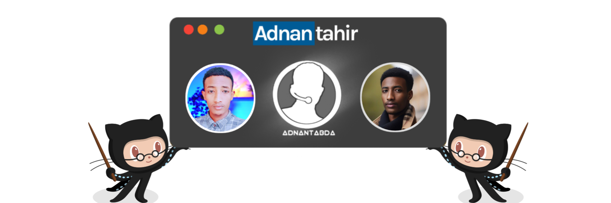

# ❄️ Adnan Tahir ❄️



**`Design-Minded Software Engineer || Python || MERN stack|| Django || Expertly Integrating Aesthetics , Functionality, and MySQL DataBase `**

```python
print("Hello, world! 🤝 ") 
``` 

<h2>:mailbox: MY CONTACT INFORMATION! </h2>

[](https://twitter.com/adnantabda)[](https://www.linkedin.com/in/adnantabda/) [](https://instagram.com/adnantabda) [](mailto:adnantahirabdah@gmail.com)

<h1> my github status! </h1>

<p align="left">
      <a href="https://github.com/adnantabda?tab=followers">
         </a>
      <a href="https://github.com/adnantabda?tab=repositories&sort=stargazers">
         </a>
   </p>

<h2>🧰 Languages and Tools</h2>
 


<br />
<br />
 
<h2>⚡ Stats<h2>


